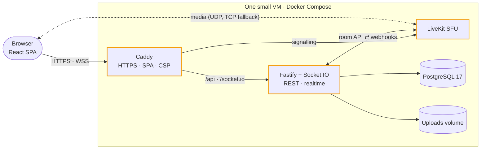
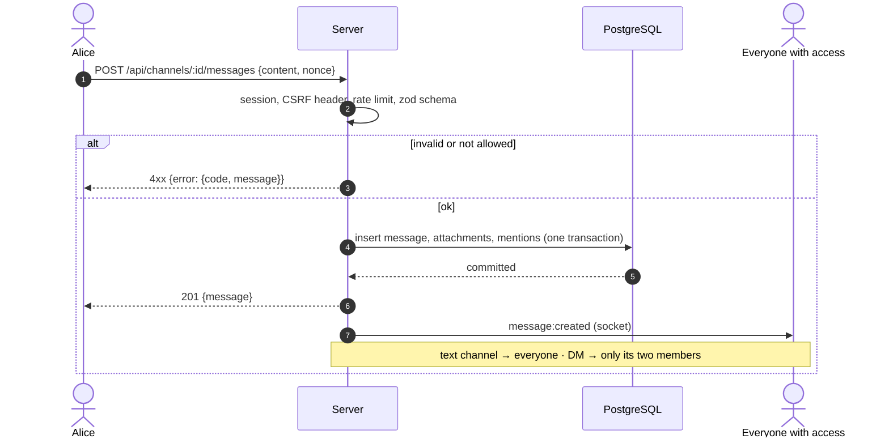
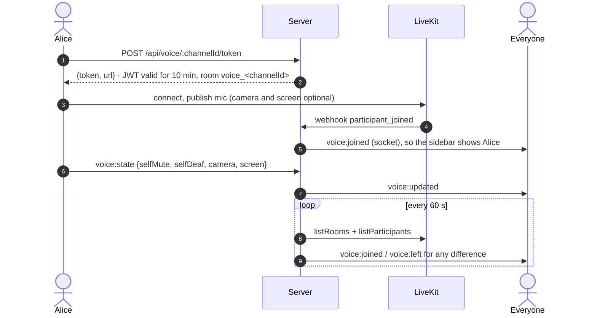
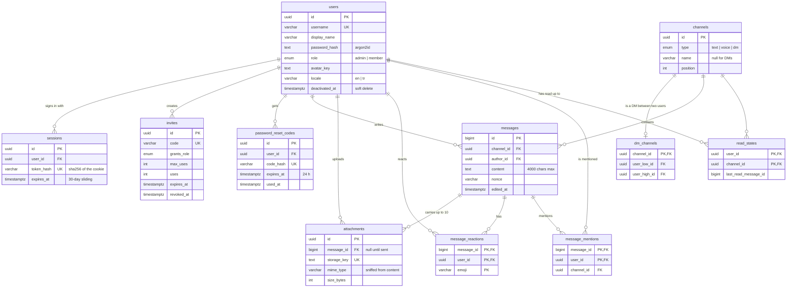
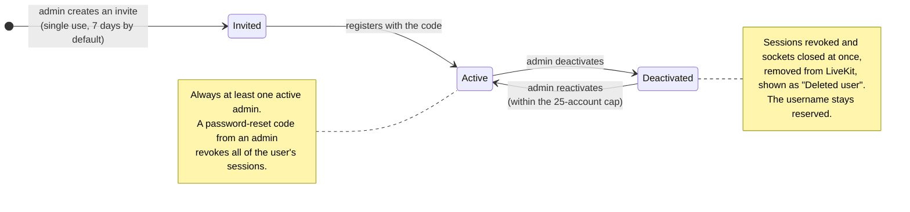
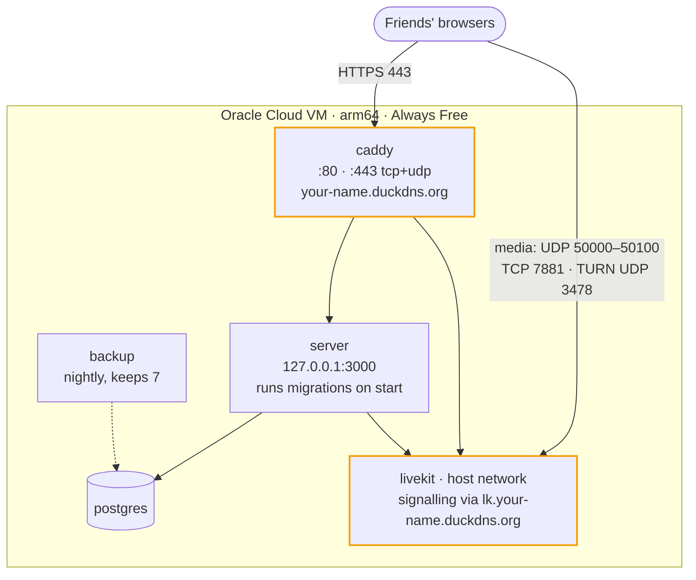
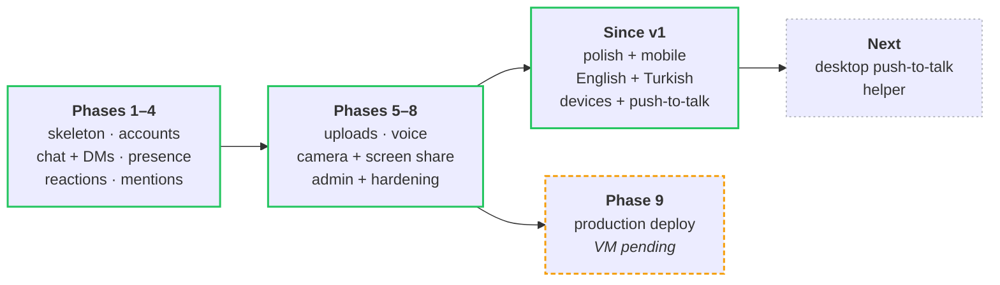

<div align="center">

<picture>
  <source media="(prefers-color-scheme: dark)" srcset="docs/assets/banner-dark.svg">
  
</picture>

<h3>A tiny, self-hosted Discord for one group of friends.</h3>

<p>Text channels, DMs, voice, camera and screen share, all in the browser.<br/>
Invite-only, one community, and it runs on a single free-tier VM.</p>

<p>
  
  
  
  
  
  
  <br/>
  
  
  
  
  
  
  <br/>
  
  
  
  
</p>

<p>
  <a href="#-features"><b>Features</b></a> ·
  <a href="#-how-it-works"><b>How it works</b></a> ·
  <a href="#-quick-start"><b>Quick start</b></a> ·
  <a href="#-deploy"><b>Deploy</b></a> ·
  <a href="#-security"><b>Security</b></a> ·
  <a href="#-docs"><b>Docs</b></a>
</p>

</div>

<br/>

<table align="center">
  <tr>
    <td align="center" width="25%"><h3>6–8</h3>friends it's built for<br/><sub>hard cap of 25 accounts</sub></td>
    <td align="center" width="25%"><h3>1 VM</h3>for everything<br/><sub>Oracle Cloud Always Free, arm64</sub></td>
    <td align="center" width="25%"><h3>0</h3>lines of custom WebRTC<br/><sub>all media goes through LiveKit</sub></td>
    <td align="center" width="25%"><h3>1,000+</h3>automated tests<br/><sub>unit, integration and end-to-end</sub></td>
  </tr>
</table>

## ✨ Features

Hearth works like a small Discord server: one community, invite-only registration, and everything runs in the browser.
Media goes through a self-hosted [LiveKit](https://livekit.io) server; the rest is a Fastify + Socket.IO server with
PostgreSQL and a React web app. The layout also works on phones.

<table>
  <tr>
    <td width="33%" valign="top">
      <br/>
      <b>Text channels</b><br/>
      A safe Markdown subset, edit and delete, history that loads older messages as you scroll, unread badges and
      typing indicators.
    </td>
    <td width="33%" valign="top">
      <br/>
      <b>Direct messages</b><br/>
      1:1 conversations, visible only to the two people in them.
    </td>
    <td width="33%" valign="top">
      <br/>
      <b>Reactions</b><br/>
      A built-in palette of about 40 emoji, or any single emoji.
    </td>
  </tr>
  <tr>
    <td valign="top">
      <br/>
      <b>Mentions and notifications</b><br/>
      <code>@username</code> highlights, mention badges, and opt-in desktop notifications for mentions and DMs while
      the tab is in the background.
    </td>
    <td valign="top">
      <br/>
      <b>Presence</b><br/>
      See who's online, live.
    </td>
    <td valign="top">
      <br/>
      <b>Uploads and avatars</b><br/>
      Any file up to 25 MB. Images preview inline and everything else downloads. Plus profile avatars.
    </td>
  </tr>
  <tr>
    <td valign="top">
      <br/>
      <b>Voice</b><br/>
      Join and leave, mute and deafen, a speaking indicator and per-person volume. Everyone sees who's in which
      voice channel.
    </td>
    <td valign="top">
      <br/>
      <b>Camera</b><br/>
      360p, 720p or 1080p at 30 fps. Pick whose video to watch.
    </td>
    <td valign="top">
      <br/>
      <b>Screen share</b><br/>
      Screen, window or tab at up to 1080p30, with optional tab audio and a LIVE badge in the sidebar.
    </td>
  </tr>
  <tr>
    <td valign="top">
      <br/>
      <b>Devices and push-to-talk</b><br/>
      Choose your mic, speakers and camera. Use push-to-talk or a voice-activity gate with a level meter, and noise
      suppression.
    </td>
    <td valign="top">
      <br/>
      <b>Admin tools</b><br/>
      Manage invites, channels and users (roles, deactivate and reactivate, password-reset codes), and disconnect
      someone from voice.
    </td>
    <td valign="top">
      <br/>
      <b>English and Turkish</b><br/>
      The whole UI in both languages, saved per account.
    </td>
  </tr>
</table>

<details>
<summary><b>Not in v1</b></summary>

<br/>

Not included: multiple servers, group DMs, calls in DMs, private channels, search, link previews, bots, email, mobile
apps and end-to-end encryption. The full list is in [PLAN.md](PLAN.md) §1.

</details>

## 🔥 How it works



- The browser talks to one origin for the app (no CORS). Non-GET API calls carry `X-Requested-With: hearth`,
  and the Socket.IO handshake checks `Origin` and the session cookie.
- For voice, the browser asks the server for a short-lived LiveKit token (`POST /api/voice/:channelId/token`,
  CONTRACTS.md B.4 row 29 and B.6), then connects to LiveKit directly. The server receives LiveKit's webhooks and
  periodically reconciles its voice state with LiveKit's room list. Hearth never runs its own WebRTC, signalling or
  TURN code: all media goes through LiveKit.
- Locally (dev, e2e, full stack) the browser reaches LiveKit at `ws://localhost:7880` with media on UDP 7882.
- Every request and socket event from a client is validated with zod, and broadcasts happen only after the DB write
  commits.

Ports, URLs and env per environment (dev, e2e, unit, full stack, LAN, prod) are in
[docs/CONTRACTS.md → B.8](docs/CONTRACTS.md#b8-runtime-topology-ports-urls-env).

### Sending a message



### Joining voice



<details>
<summary><b>Data model</b>: 11 tables, from <code>apps/server/src/db/schema.ts</code></summary>

<br/>



</details>

<details>
<summary><b>Account lifecycle</b>: invites, deactivation and the last-admin rule</summary>

<br/>



</details>

## 🧰 Tech stack

| Layer      | What's used (exact versions are pinned in [CLAUDE.md](CLAUDE.md))                                                             |
| ---------- | ----------------------------------------------------------------------------------------------------------------------------- |
| **Web**    | React 19, Vite 8, Tailwind CSS 4, react-router, TanStack Query 5, zustand 5, socket.io-client, livekit-client, react-markdown |
| **Server** | Node 26, Fastify 5 (cookie, multipart, rate-limit), Socket.IO 4, Drizzle ORM + `pg`, argon2id, livekit-server-sdk, file-type  |
| **Shared** | `packages/shared`: zod 4 schemas, inferred types, error codes, socket event maps, limits, emoji palette                       |
| **Infra**  | PostgreSQL 17, LiveKit server, Caddy 2, Docker Compose                                                                        |
| **Tests**  | Vitest (against real Postgres and LiveKit) and Playwright (Chromium with fake media devices)                                  |
| **Tools**  | pnpm 12 workspaces, TypeScript 7 strict, ESLint + typescript-eslint, Prettier                                                 |

## 🚀 Quick start

**You need:**

- Node 26 and pnpm 12.6.0 (the exact pnpm version is pinned in `package.json` → `packageManager`)
- Docker with the compose plugin (Postgres and LiveKit run in containers, even in dev)
- Chromium for the e2e tests: `pnpm exec playwright install chromium` (add `--with-deps` only on Debian/Ubuntu)

**Then:**

```bash
pnpm install
cp .env.example .env                       # local-only values; never commit .env
pnpm infra:up                              # Postgres :5432 and LiveKit :7880 in Docker
pnpm db:migrate                            # apply the Drizzle migrations to the `hearth` database
pnpm dev                                   # web on http://localhost:5173 → server on :3000
pnpm --filter @hearth/server bootstrap     # prints a one-time admin invite link (valid 24 h)
```

Open the printed `http://localhost:5173/register?invite=…` link and create the first admin account. From there,
invite others from **Admin → Invites**. `pnpm infra:down` stops the containers (data is kept in Docker volumes).

In dev, `localhost` counts as a secure origin, so the microphone, camera and screen share work without HTTPS.

<details>
<summary><b>Full stack in Docker</b></summary>

<br/>

```bash
docker compose up --build                             # web (Caddy) on http://localhost:8080
docker compose exec server node dist/cli/bootstrap.js # first admin invite
docker image prune -f                                 # every rebuild leaves the old images behind
```

This runs the production images locally: Caddy serves the web build and proxies `/api` and `/socket.io` to the
server, which runs its migrations on start.

</details>

<details>
<summary><b>LAN testing</b> (voice with a phone or laptop on the same Wi-Fi)</summary>

<br/>

`pnpm lan:up` / `pnpm lan:down` serve the app over HTTPS from Caddy's local CA. See
[docs/DEPLOY.md → LAN testing](docs/DEPLOY.md#lan-testing-voice-with-devices-on-the-same-wi-fi).
`pnpm lan:down` also stops Postgres and LiveKit, so run `pnpm infra:up` afterwards for dev.

</details>

## 🌍 Deploy

Production is one Oracle Cloud VM with a DuckDNS name and Let's Encrypt certificates. The step-by-step guide is
[docs/DEPLOY.md → Production on Oracle Cloud](docs/DEPLOY.md#production-on-oracle-cloud).



> [!IMPORTANT]
> Mic and screen capture need HTTPS in production. LiveKit needs TCP 7881 and the UDP range open in **both** the
> Oracle VCN security list and the VM's iptables.

<details>
<summary><b>Maintenance</b> (update, backups, restore, health)</summary>

<br/>

All on the VM, with `hc` as the compose alias from [docs/DEPLOY.md](docs/DEPLOY.md) step 5:

- **Update:** `infra/scripts/deploy.sh` makes a pre-deploy backup, pulls, rebuilds, restarts and tags the release
  (`deploy-YYYYMMDD`). Roll back with `infra/scripts/deploy.sh --ref deploy-<date>` (plus a restore if the release
  changed the database; `deploy.sh` prints the exact commands).
- **Backups:** the `backup` container makes a nightly `pg_dump` + uploads tarball into `data/backups/` and keeps 7.
  `infra/scripts/backup.sh` makes one now. **Copy them off the VM every week** (they live on the same disk as the
  database), e.g. `rsync -av ubuntu@<ip>:hearth/data/backups/ ~/hearth-backups/`.
- **Restore:** `infra/scripts/restore.sh data/backups/<timestamp>` (asks for confirmation and backs up the current
  state first). Do the restore drill from DEPLOY.md once after the first deploy.
- **Health:** `infra/scripts/status.sh` (health endpoint, containers, disk, backup age, certificate expiry) and
  `hc logs --since 1h server`.
- **Disk:** `docker image prune -f` after rebuilds.

</details>

## 🧪 Checks and tests

| Command          | What it runs                                                                 |
| ---------------- | ---------------------------------------------------------------------------- |
| `pnpm typecheck` | TypeScript 7 in every workspace, plus the e2e project                        |
| `pnpm lint`      | ESLint (runs on TypeScript 6, see CLAUDE.md)                                 |
| `pnpm format`    | Prettier `--write` (`pnpm format:check` to only check)                       |
| `pnpm test`      | Vitest: unit + integration against real Postgres (`hearth_unit`) and LiveKit |
| `pnpm test:e2e`  | Playwright: boots its own server on :3100 and web on :5273 (`hearth_e2e`)    |

`pnpm test` and `pnpm test:e2e` need `pnpm infra:up` running. The e2e suite uses Chromium with fake media devices
and the real LiveKit container, so voice, camera and screen share are tested end to end.

<details>
<summary><b>Full-stack smoke test</b> against a running <code>docker compose up --build</code></summary>

<br/>

```bash
E2E_BASE_URL=http://localhost:8080 pnpm test:e2e --grep @smoke
```

Optional variables for the logged-in security-header and CSP checks:

| Variable             | Meaning                                                                                   |
| -------------------- | ----------------------------------------------------------------------------------------- |
| `E2E_USERNAME`       | an existing account on that stack (e.g. the admin you bootstrapped)                       |
| `E2E_PASSWORD`       | its password                                                                              |
| `E2E_VOICE_CHANNEL`  | the name of an existing voice channel, for the voice-join-under-CSP check                 |
| `E2E_LIVEKIT_ORIGIN` | the LiveKit origin(s) the CSP must allow, when not `ws://localhost:7880` (e.g. LAN, prod) |

</details>

## 🔒 Security

| Area          | What Hearth does                                                                                                                                        |
| ------------- | ------------------------------------------------------------------------------------------------------------------------------------------------------- |
| **Sign-up**   | Invite-only, with no open registration. Invites are single use and last 7 days by default, and can be revoked.                                          |
| **Admins**    | There's always at least one active admin. Deactivated users lose their sessions, sockets and voice at once.                                             |
| **Sessions**  | Opaque tokens in `HttpOnly; SameSite=Lax` cookies (`Secure` in production), stored hashed, 30-day sliding expiry.                                       |
| **Passwords** | Hashed with argon2id. Login, reset, message send, uploads and admin actions are rate-limited.                                                           |
| **Headers**   | Caddy sets a strict CSP (only the app itself and the LiveKit origin), `nosniff`, `Referrer-Policy`, `Permissions-Policy`, COOP, and HSTS in production. |
| **Uploads**   | Type-sniffed from their content, served only to people who can see them, and non-images are always downloads.                                           |
| **Secrets**   | Only in `.env` (dev) and `.env.prod` (production, generated by `infra/scripts/gen-secrets.sh`, mode 600). Never commit them.                            |
| **Test mode** | `HEARTH_TEST_MODE` exposes a reset endpoint for e2e; the server refuses to boot with it in production.                                                  |
| **Backups**   | They contain every message and password hash: keep your copies private.                                                                                 |

<details>
<summary><b>Limits</b></summary>

<br/>

| Item                           | Limit                  |
| ------------------------------ | ---------------------- |
| Active accounts                | 25                     |
| Channels (text + voice)        | 50                     |
| Message length                 | 4000 characters        |
| Attachments per message        | 10                     |
| Upload size                    | 25 MB (avatar 2 MB)    |
| Distinct reactions per message | 20                     |
| Message send                   | 10 per 10 s per user   |
| Login / reset attempts         | 10 per minute per IP   |
| Uploads                        | 20 per minute per user |

</details>

## 🧭 Status



<sub>🟢 done · 🟠 artifacts ready, waiting on the real VM · ⚪ planned. Details per phase are in
[PROGRESS.md](PROGRESS.md).</sub>

## 📚 Docs

<details>
<summary><b>Project layout</b></summary>

<br/>

```
apps/
  server/          Fastify + Socket.IO API
    src/routes/    REST endpoints          src/services/   business logic and DB access
    src/realtime/  sockets, presence       src/livekit/    tokens, webhooks, reconcile
    src/storage/   uploads on disk + GC    src/cli/        bootstrap, livekit-test-token
    src/db/        Drizzle schema          drizzle/        SQL migrations
  web/             React 19 + Vite + Tailwind 4 (pages/, components/, stores/, voice/, api/)
packages/
  shared/          zod schemas, types, error codes, socket event maps, limits, emoji palette
e2e/               Playwright specs and fixtures
infra/
  caddy/           Caddyfile (local), Caddyfile.lan, Caddyfile.prod
  livekit/         livekit.yaml (local), livekit.lan.yaml, livekit.prod.yaml
  postgres/init/   creates the hearth_unit and hearth_e2e databases
  scripts/         lan-up/down, gen-secrets, backup, restore, deploy, status
docker-compose.yml        local full stack (dev/e2e use only postgres + livekit)
docker-compose.lan.yml    LAN test overlay
docker-compose.prod.yml   production (Oracle Cloud)
```

</details>

| File                                   | What it holds                                                                      |
| -------------------------------------- | ---------------------------------------------------------------------------------- |
| [PLAN.md](PLAN.md)                     | the spec: goal, roles, features, stack, phases, limits (source of truth)           |
| [docs/CONTRACTS.md](docs/CONTRACTS.md) | binding DB schema, REST endpoints, socket events, LiveKit and lifecycle rules, env |
| [docs/DEPLOY.md](docs/DEPLOY.md)       | LAN testing and the production runbook (VM, DNS, firewall, backups, updates)       |
| [docs/plans/](docs/plans/)             | the approved plan for each phase (2–9) and later passes, including UI test hooks   |
| [PROGRESS.md](PROGRESS.md)             | what's built and tested per phase, known issues, and what's still pending          |
| [CLAUDE.md](CLAUDE.md)                 | working rules, commands, pinned versions and gotchas                               |

A change to an API, DB or event contract updates docs/CONTRACTS.md in the same commit. Schema changes go only through
Drizzle migrations (`pnpm db:generate` after editing `apps/server/src/db/schema.ts`, then `pnpm db:migrate`).

<br/>

<div align="center">
  <br/>
  <sub>Built for one group of friends.</sub>
</div>
